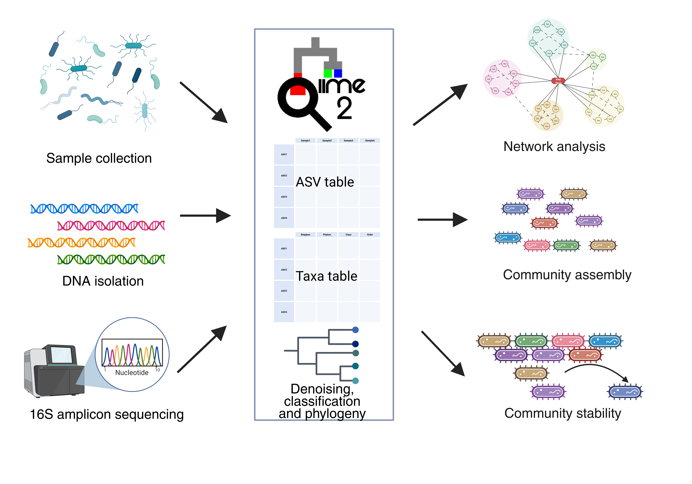

# Deciphering Global Patterns of Marine Microbial Community Assembly and Network Stability

## Abstract
Microbial community ecology seeks to unravel the patterns and processes that govern the diversity, assembly, and functional stability of microbial assemblages across global ecosystems. In recent years, the increased availability of sequencing data from large-scale ocean microbiome projects has made it feasible to study microbial community assembly and its underlying mechanisms across global marine environments. In this study, we have investigated species richness patterns, community assembly mechanisms, and interaction patterns of marine bacterial communities by analyzing 16S ribosomal RNA amplicon sequencing data from 4,611 samples collected from ocean microbiome projects. Using neutral community models, the iCAMP framework, and co-occurrence network analyses, we showed that stochastic processes drive microbial community assembly across all latitude zones. In the polar zone, dispersal limitation was the primary driver of community assembly, compared with temperate and tropical communities, where dispersal limitation and selection played an important role. Polar microbial communities exhibited the highest modularity and network robustness, but were more vulnerable to hub removal. Although previous studies have attributed the higher stability of polar communities to environmental filtering, our analyses reveal that the resilience of the community is dependent on a few central taxa. By classifying the genera as generalists and specialists, we further highlight the role played by the specialist taxa in maintaining the stability of the marine microbial community, especially under the pressures of climate change and global warming. In general, our findings offer a latitudinal perspective on the stability of the ocean bacterial community, with implications for understanding their responses to environmental disturbances.

Our analysis is distributed into five major parts:
1. Compare microbial diversity across marine environments and latitudinal gradients
2. Infer microbial associations in ocean ecosystems and identify their ecological significance
3. Identify potential metabolic cross-feeding interactions that enable microbial associations
4. Explore the role of microbial communities in maintaining ecosystem stability and resilience under environmental perturbations
5. Understand how the microbial communities vary between different sample origins (marine sediment, water, coral and sponge-associated samples) using statistical, community assembly and network analyses. 

Here we have the overview of our approach below: 

## Cite: 
Ravikumar P, Ravindran A, Raman K.0. Deciphering global patterns of marine microbial community assembly and network stability. mSystems0:e00470-26. https://doi.org/10.1128/msystems.00470-26
